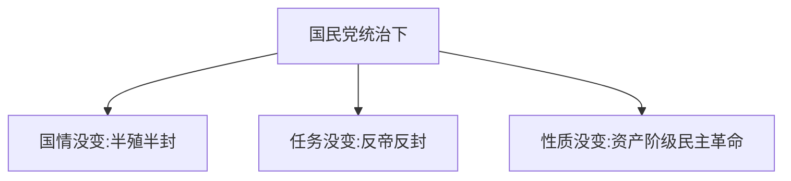
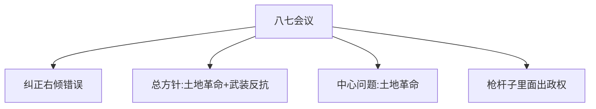
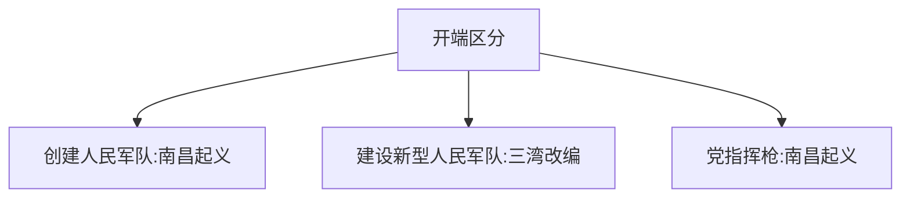

# 中国革命的新道路

## 重难点提要

当时的中国存在"三股势力"：
1. 北京的北洋政府
2. 上海的中国共产党
3. 广州的国民党

国共联合北伐推翻北洋政府 → 国民党反革命政变 → 白色恐怖 → 共产党探索新道路

---

## 考点41 国民党在全国统治的建立

### 三个"没有变"

### 旧民主主义革命 vs 新民主主义革命

| 对比 | 旧民主主义革命 | 新民主主义革命 |
|------|--------------|--------------|
| **分界线** | 五四运动 | 五四运动 |
| **领导者** | 资产阶级 | 无产阶级 |
| **性质** | 资产阶级旧民主主义革命 | 资产阶级新民主主义革命 |
| **任务/对象** | 反帝反封建 | 反帝反封建 |

**关键**：决定革命性质的是**任务和对象**，不是领导者

---

## 考点42 土地革命战争的兴起

### 八七会议

### "左倾"和"右倾"

| 错误 | 表现 |
|------|------|
| **右倾机会主义** | 太过于依赖资产阶级 |
| **"左"倾教条主义** | 太过于针对资产阶级 |

### 时间线

| 时期 | 时间 | 标志/转折点 |
|------|------|-----------|
| 大革命时期 | 1925-1927 | 五卅运动 |
| 土地革命时期 | 1927-1937 | 八七会议 |

### 三个"开端"

---

## 考点43 农村包围城市、武装夺取政权

### 第一个红色政权

> 茶陵县工农兵政府

---

## 核心考点速记

1. **三个没有变**：国情、任务、性质
2. **决定革命性质**：任务和对象（不是领导者）
3. **八七会议**：土地革命+武装反抗，枪杆子里面出政权
4. **三个开端**：南昌起义（创建军队）、三湾改编（建设军队）、南昌起义（党指挥枪）
