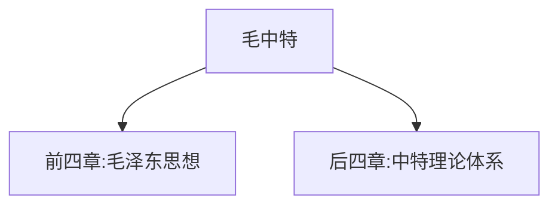
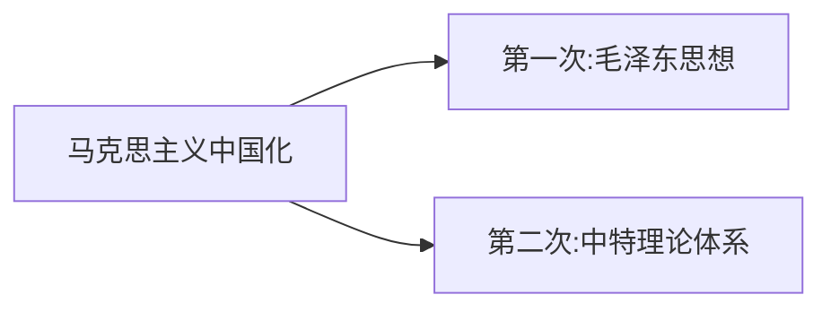

# 毛泽东思想和中国特色社会主义理论体系概论 - 导论

## 学科框架

**复习建议**：先学史纲，再学毛中特

---

## 考点1 马克思主义中国化时代化的内涵

### 内涵（是什么）

1. 用他的理论解决我的问题
2. 用我的问题丰富他的理论
3. 用我的民族语言去重新表述他的理论

### 重要事件

| 事件 | 意义 |
|------|------|
| 毛泽东在六届六中全会作《论新阶段》报告 | 标志着"马克思主义中国化"命题的正式提出 |
| 中共七大 | 完成马克思主义中国化第一次飞跃 |

### 马克思主义中国化时代化的两次飞跃

### 必要性（为什么要推进马克思主义中国化时代化）

1. 理论需要实际
2. 实际需要理论

---

## 徐涛点拨

- **易错点**：  - 马克思主义中国化**命题的正式提出**：六届六中全会《论新阶段》
  - 马克思主义中国化**第一次飞跃完成**：中共七大
  - 不要把"命题提出"和"第一次飞跃完成"混淆

- **易错点**：  - 毛泽东思想是**第一次飞跃**的成果
  - 中特理论体系是**第二次飞跃**的成果
  - 习近平新思想属于中特理论体系的一部分

---

## 真题角度

1. 从**马克思主义中国化内涵**角度考查：三个方面的理解
2. 从**重要事件**角度考查：六届六中全会、中共七大的意义
3. 从**两次飞跃**角度考查：毛泽东思想、中特理论体系

---

## 核心考点速记

1. **毛中特**：毛泽东思想+中特理论体系
2. **马克思主义中国化命题提出**：六届六中全会《论新阶段》
3. **第一次飞跃完成**：中共七大
4. **两次飞跃**：毛泽东思想、中特理论体系

