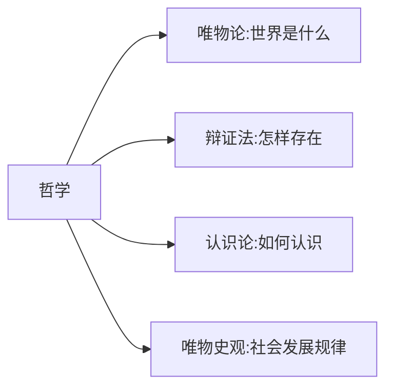
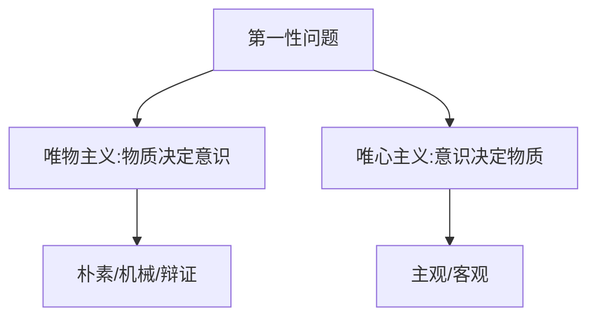

# 马克思主义哲学 - 哲学及其基本问题

## 马克思主义哲学的四大板块

---

## 考点7 哲学基本问题及不同哲学流派

### 哲学基本问题

**思维与存在的关系问题**（意识与物质的关系问题）

包含两个方面：
- **第一性问题**：物质和意识何者为第一性？
- **同一性问题**：物质和意识是否具有同一性？

---

### 第一性问题（区分唯物主义和唯心主义）

#### 唯物主义三大派别

| 派别 | 物质定义 | 例子 |
|------|---------|------|
| **古典（朴素）唯物主义** | 物质=实物 | 五行说、火本源说、水本源说 |
| **机械（近代形而上学）唯物主义** | 物质=粒子 | 原子、分子 |
| **辩证唯物主义** | 物质=一切客观存在 | - |

**注意**：
- 机械论一定是形而上学，但形而上学不一定是机械论
- 前两派是**半截子唯物主义**（只在自然观上唯物，历史观上唯心）
- 马克思主义是**彻底的唯物主义**（自然观和历史观都是唯物的）

#### 唯心主义两大派别

| 派别 | 精神本原 | 例子 |
|------|---------|------|
| **主观唯心主义** | 本我的精神 | 笛卡尔"我思故我在"、王阳明"吾心即天心""心外无物"、慧能"不是风动，不是幡动，是仁者心动" |
| **客观唯心主义** | 独立于人之外的精神 | 上帝、程朱理学 |

---

### 同一性问题（区分可知论和不可知论）

| 流派 | 观点 |
|------|------|
| **可知论** | 二者有同一性，意识能认识物质 |
| **不可知论** | 二者没有同一性，意识不能认识物质 |

**关键点**：
- 唯物主义和彻底的唯心主义都是**可知论**
- **二元论**最终会滑向不可知论

---

### 世界怎样存在（区分辩证法和形而上学）

| 流派 | 观点 |
|------|------|
| **形而上学** | 世界是孤立的、片面的、静止的、无矛盾的 |
| **辩证法** | 世界是联系的、全面的、发展的、有矛盾的 |

**马克思的贡献**：首次将唯物论与辩证法结合，形成**辩证唯物主义**

---

## 马克思主义在哲学史上的两大历史贡献

- 创立了**唯物史观**
- 形成了**辩证唯物主义**

---

## 徐涛点拨

- 哲学基本问题 = 思维与存在的关系问题
- 半截子唯物主义 = 朴素唯物主义 + 机械唯物主义
- 主观唯心主义 = 本我的精神；客观唯心主义 = 独立于人之外的精神
- 唯物主义和彻底的唯心主义都是可知论
- 马克思首次将唯物论与辩证法结合`n**易错点**：第一性问题区分唯物主义和唯心主义（不是可知论和不可知论）
- 同一性问题区分可知论和不可知论（不是唯物主义和唯心主义）
- 机械论一定是形而上学，但形而上学不一定是机械论
- 慧能"不是风动，不是幡动，是仁者心动"是主观唯心主义
- 二元论最终会滑向不可知论

**口诀**：**主观"我思故我在"，客观"上帝程朱理学"**
- **形而上学孤立片面静止，辩证法联系全面矛盾**

---

## 真题角度

- 从**哲学基本问题**角度考查
- 从**唯物主义三大派别**角度考查
- 从**唯心主义两大派别**角度考查
- 从**马克思的贡献**角度考查

---

## 核心考点速记

- **哲学基本问题**：思维与存在的关系问题
- **第一性问题**：区分唯物主义和唯心主义
- **同一性问题**：区分可知论和不可知论
- **唯物主义三大派别**：朴素、机械、辩证
- **唯心主义两大派别**：主观、客观
- **两大历史贡献**：唯物史观、辩证唯物主义

