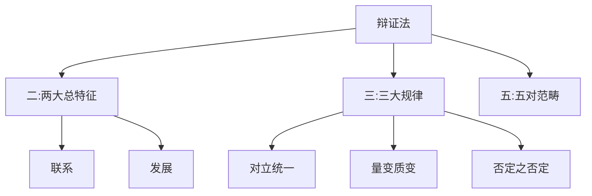

# 唯物辩证法 - 两大总特征

## 辩证法主体知识框架

---

## 考点17 唯物辩证法两大总特征

### 一、联系的特点

| 特点 | 含义 | 注意 |
|------|------|------|
| **客观性** | 不以人的意志为转移 | 人类可以改变联系的具体表现，但不能凭空创造或消灭客观联系 |
| **普遍性** | ①事物内部有联系；②事物之间有联系；③世界是一张普遍联系的网络 | - |
| **多样性** | 联系的形式多种多样 | - |
| **条件性** | ①条件分有利与不利；②通过改变和创造条件，化不利为有利；③改变条件必须尊重客观规律 | - |

**方法论意义**：坚持**系统观念**，把事情当作一个整体做整体规划

---

### 二、发展

#### 区分运动、变化与发展

| 概念 | 范围 | 特点 |
|------|------|------|
| **运动** | 最广 | 无条件的、绝对的 |
| **变化** | 次之 | 包含前进和倒退 |
| **发展** | 最窄 | 仅指前进的、上升的运动 |

**关系**：运动 = 变化 > 发展

#### 新旧事物的区分

| 标准 | 说明 |
|------|------|
| ❌ 不按时间先后 | 新事物不一定产生于旧事物之后 |
| ✅ 按本质特征 | 是否顺应历史方向、是否符合事物规律、是否具有远大前途 |

#### 新事物必然战胜旧事物的原因

- 新事物具有新功能、新结构，适应新环境
- 新事物在旧事物的母体中成熟，比旧事物更先进
- 新事物能够受到人民群众的拥护

**方法论意义**：用**过程的眼光**去看待万事万物

---

## 多选题解题技巧

### 判断题干侧重点

- 规避与侧重点**截然相反**的选项

### 区分"并列概念"与"上位概念"

| 类型 | 定义 | 处理 |
|------|------|------|
| **并列概念** | 与题干关键词处于同一层级、相互独立 | 一般排除 |
| **上位概念** | 涵盖题干关键词、包含其核心内涵 | 一般可入选 |

**例**：
- 题干"量子"，选项"物质" → 上位概念，可入选
- 题干"经济发展"，选项"民主政治建设" → 并列概念，排除

---

## 徐涛点拨

- **易错点**：  - 客观性：人类可以改变联系的**具体表现**，但不能凭空创造或消灭**客观联系**
  - 条件性：改变条件必须**尊重客观规律**

- **易错点**：  - 运动是无条件的、绝对的
  - 发展仅指前进的、上升的运动（不包括倒退）
  - 运动变化的结果可能会倒退，但总趋势是发展

- **易错点**：  - 新事物不一定产生于旧事物之后
  - 判断标准：是否顺应历史方向、是否符合事物规律、是否具有远大前途

---

## 真题角度

- 从**联系的特点**角度考查：客观性、普遍性、多样性、条件性
- 从**运动、变化、发展**角度考查：三者的区别和联系
- 从**新旧事物**角度考查：区分标准、新事物必然战胜旧事物的原因

---

## 核心考点速记

- **联系的特点**：客观性、普遍性、多样性、条件性
- **运动、变化、发展**：运动 = 变化 > 发展
- **新旧事物区分**：按本质特征，不按时间先后
- **新事物必然战胜旧事物**：三个原因
- **方法论**：系统观念、过程眼光

