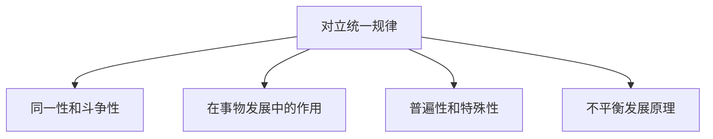
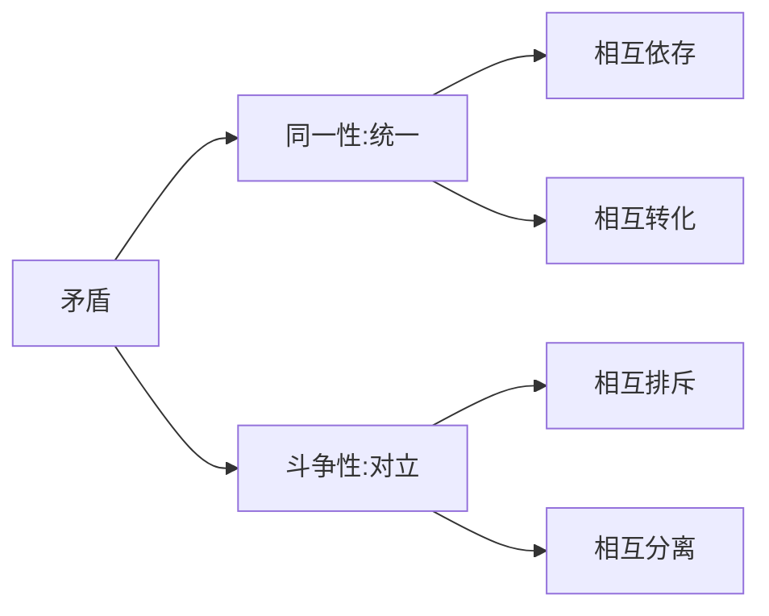
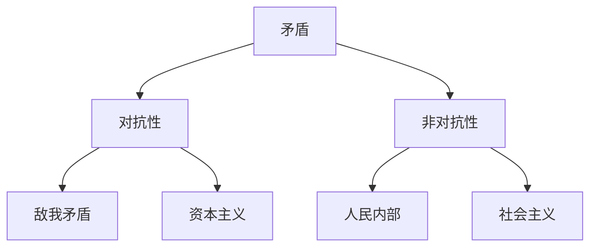

# 唯物辩证法 - 对立统一规律（矛盾规律）

## 重要性

- 对立统一规律在选择题和分析题中都属于**高频重点**
- 每三年的考试中，有两年的分析题都与对立统一规律有关
- 该考点下的四个小点，每一个都有可能单独命制分析题

---

## 对立统一规律整体框架

---

## 1. 矛盾的同一性和斗争性及其辩证关系

### 矛盾的两种基本属性

### 对抗与非对抗

### 寓于关系

> **斗争性寓于同一性之中**（只能说斗争性寓于同一性，不能反过来说）

### 方法论意义

- 看问题**"一分为二"**，不能全盘否定或全盘肯定
- **物极必反**
- **中庸和谐**，不走极端

---

## 2. 矛盾的同一性和斗争性在事物发展过程中的作用

| 作用 | 表现 | 结果 |
|------|------|------|
| **同一性** | 弱势向强势转化，转化后更强 | 相辅相成 |
| **斗争性** | 此消彼长→量变；地位转化→质变 | 相反相成 |

**方法论**：学会逆向思维

---

## 3. 矛盾的普遍性和特殊性及其辩证关系

### 基本概念

| 概念 | 含义 |
|------|------|
| **矛盾的普遍性** | 万事万物中都存在着矛盾 |
| **矛盾的特殊性** | 每个具体的矛盾及其不同阶段都有不同特点 |
| **共性** | = 普遍性 |
| **个性** | = 特殊性 |

### 共性与个性的关系

- 共性与个性**并不是**说一种事物有共性，另一种事物有个性
- 而是**同一个事物**中既有共性又有个性

### 寓于关系

> **共性寓于个性之中**（共性被包含于个性之中）

- 世界上的人是由一个个独立的、特别的"你，我，他"组成的（个性）
- 正因为有了这些独立的个体，才有了"人"这个共性的概念

### 方法论意义

| 概念 | 内容 |
|------|------|
| **矛盾问题的精髓** | 共性与个性（普遍性和特殊性） |
| **矛盾的基本属性** | 对立性和统一性（斗争性和同一性） |

### 人类认识世界的过程

**个性 → 共性 → 个性**（先从个别入手，再提炼到一般，再到个别中去验证）

### 马克思主义中国化的哲学原理

- 马克思主义基本原理 = **共性**
- 中国实际情况 = **个性**
- 方法论：要**具体问题具体分析**

---

## 4. 矛盾的不平衡发展原理

### 主要矛盾和次要矛盾

| 概念 | 作用 |
|------|------|
| **主要矛盾** | 对事物发展起**决定性**作用 |
| **次要矛盾** | 对事物发展起次要作用 |

### 矛盾的主要方面和次要方面

- 矛盾的**主要方面**决定着事物的**性质**

### 方法论意义

> **"两点论"和"重点论"统一**（主次都要抓，突出主要矛盾）

---

## 矛盾分析法

与矛盾有关的原理得出的方法都叫矛盾分析法：

- 看问题要**"一分为二"**
- **具体问题具体分析**
- **"两点论"和"重点论"结合**

---

## 徐涛点拨

- 矛盾的两种基本属性 = 同一性（统一）+ 斗争性（对立）
- 对抗性矛盾 = 敌我矛盾；非对抗性矛盾 = 人民内部矛盾
- 同一性→相辅相成；斗争性→相反相成
- 矛盾问题的精髓 = 共性与个性
- 主要矛盾决定事物发展，矛盾主要方面决定事物性质`n**易错点**：同一性和斗争性是"既...又..."的关系，不是"时而...时而..."的关系
- **斗争性寓于同一性之中**（只能说斗争性寓于同一性，不能反过来说）
- 资本主义社会的矛盾是**对抗性**的，社会主义和共产主义的矛盾是**非对抗性**的
- 弱势向强势转化，转化后更强 → 这是同一性的作用
- 共性与个性是**同一个事物**中既有共性又有个性（不是不同事物）
- 主要矛盾和次要矛盾是**多个矛盾**之间的关系；矛盾的主要方面和次要方面是**一个矛盾内部**的关系

**口诀**：**同一相互依存转化，斗争相互排斥分离**
- **同一相辅相成，斗争相反相成**
- **共性寓于个性，矛盾精髓共个性**
- **两点论和重点论统一**

---

## 真题角度

- 从**矛盾的同一性和斗争性**角度考查
- 从**矛盾的普遍性和特殊性**角度考查
- 从**矛盾的不平衡发展原理**角度考查
- 从**矛盾分析法**角度考查

---

## 核心考点速记

- **矛盾的两种属性**：同一性（统一）和斗争性（对立）
- **同一性两层含义**：相互依存、相互转化
- **寓于关系**：斗争性寓于同一性；共性寓于个性
- **矛盾问题的精髓**：共性与个性
- **矛盾的基本属性**：对立性和统一性
- **方法论**：两点论和重点论统一

