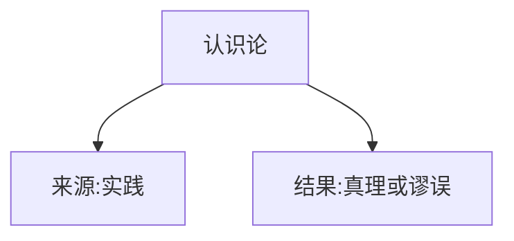
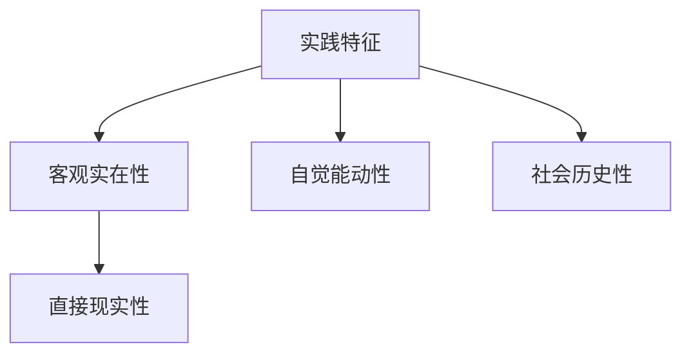
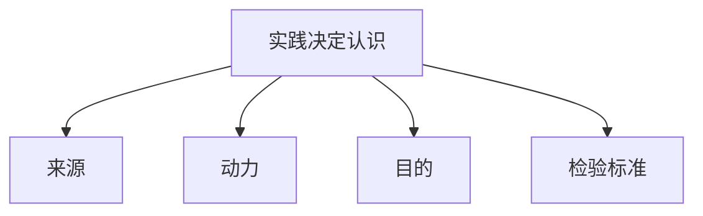

# 马克思主义认识论 - 实践

## 认识论框架

---

## 考点29 实践的本质和基本特征

### 实践的正确理解

| 角度 | 内容 |
|------|------|
| **感性的** | 受头脑指挥，体现主体的目的、意愿和创造性（能动） |
| **对象性的** | 主体指向客体的行为 |
| **物质活动** | 具有物质性的行为 |

### 实践的基本特征

---

## 考点30 实践的基本结构和形式

### 三项基本要素

| 要素 | 说明 |
|------|------|
| **实践主体** | 唯一主体是人（动物、机器人、人工智能不属于实践范畴） |
| **实践客体** | 客观事物被纳入主体实践范围后才成为现实的实践客体 |
| **实践中介** | ①物质性工具系统；②语言符号工具系统 |

### 主体与客体的三种基本关系

| 关系 | 内容 |
|------|------|
| **实践关系**（最根本） | 主体通过物质性活动能动地改造客体 |
| **认识关系** | 主体通过观察、研究等认知活动反映客体的本质与规律 |
| **价值关系** | 客体的属性是否满足主体的需要 |

### 主体客体化与客体主体化

| 概念 | 含义 | 记忆技巧 |
|------|------|---------|
| **主体客体化** | 客体在变化 | 第二个词变了（客体） |
| **客体主体化** | 主体在变化 | 第二个词变了（主体） |

### 实践的三种基本形式

| 形式 | 内容 |
|------|------|
| **物质生产实践**（劳动） | 最基本的实践活动 |
| **社会政治实践** | 处理人与人的关系 |
| **科学文化实践** | 对未知领域进行探索 |

**注意**：虚拟实践是实践的新形式，但不是基本形式

---

## 考点31 实践对认识的决定作用

### 实践与认识的关系

- 实践本质上归属于**物质范畴**
- 认识在属性上归属于**意识范畴**
- 二者关系本质上是**物质与意识**的关系

### 实践说法归纳

| 说法 | 出处 |
|------|------|
| 实践的观点是马克思主义**首要的基本**的观点 | 第7页 |
| 实践性是马克思主义理论区别于其他理论的**根本特征** | 第29页 |
| 实践的观点是辩证唯物论的认识论之**第一的和基本的**观点 | 第32页 |

### 实践对认识的决定作用（四个方面）

### 关于"此岸性"的理解

> "人应该在实践中证明自己思维的真理性，即自己思维的现实性和力量，自己思维的此岸性"

**理解**：仅停留在认识层面（此岸）无法检验认识的真理性，必须通过实践（彼岸）才能验证

---

## 徐涛点拨

- **易错点**：  - 客观实在性 = 直接现实性（将脑中的物变成现实的物）
  - 自觉能动性：受头脑指挥，体现目的、意愿和创造性
  - 社会历史性：不同历史阶段，实践的效率、广度和范围不同

- **易错点**：  - 动物、机器人、人工智能**不属于**实践范畴
  - 虚拟实践是实践的**新形式**，但不是**基本形式**
  - 物质生产实践（劳动）是**最基本的**实践活动

- **易错点**：  - 实践是检验认识真理性的**唯一标准**
  - 实践的观点是马克思主义**首要的基本**的观点

---

## 真题角度

- 从**实践的基本特征**角度考查：客观实在性、自觉能动性、社会历史性
- 从**实践的基本结构**角度考查：主体、客体、中介
- 从**实践对认识的决定作用**角度考查：四个方面

---

## 核心考点速记

- **实践基本特征**：客观实在性、自觉能动性、社会历史性
- **实践基本要素**：主体、客体、中介
- **实践最基本形式**：物质生产实践（劳动）
- **实践对认识的决定作用**：来源、动力、目的、检验标准
- **实践是检验真理的唯一标准**

