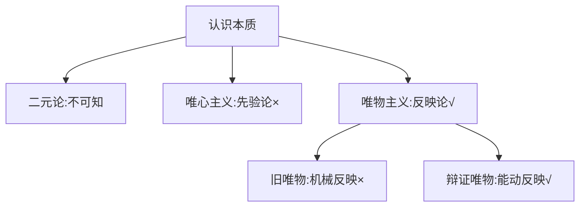
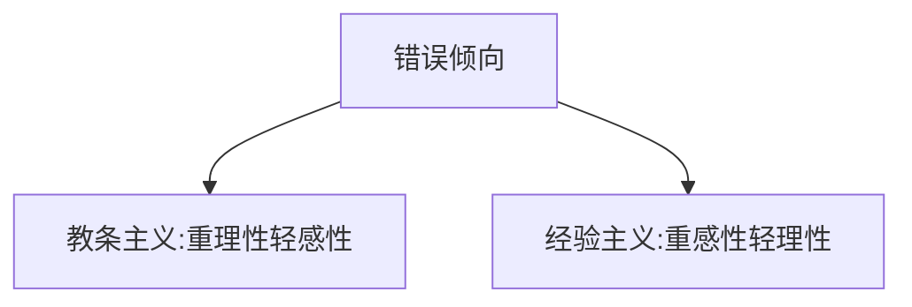

# 马克思主义认识论 - 认识

## 考点32 认识的本质

### 三种认识观

### 认识的反映特性和创造特性的关系

- **不可分割**，像一枚硬币的两面
- 在反映中创造，在创造中反映

### 错误观点

| 错误 | 表现 |
|------|------|
| 夸大反映、不看创造 | 机械反映论（旧唯物） |
| 夸大创造、不看反映 | 唯心主义、不可知论 |

---

## 考点33 认识的过程（两次飞跃）

> **特别注意**：第二次飞跃更重要

### 认识的两次飞跃

### 感性认识的三种形式

| 形式 | 含义 |
|------|------|
| **感觉** | 外界事物直接刺激感官而获得的感觉 |
| **知觉** | 由众多感觉拼凑在一起形成的对事物整体的认识 |
| **表象** | 知觉一旦形成，在人的脑中就留下了印象 |

### 理性认识的三种形式

| 形式 | 含义 |
|------|------|
| **概念** | 思维的"细胞"，是人认识事物的前提 |
| **判断** | 概念是判断的前提和依据 |
| **推理** | 有了判断就能做推理 |

### 感性认识与理性认识的关系

### 两种错误倾向

### 易考例子

> "感觉到了的东西不能立刻理解它，只有理解了的东西才能更深刻地感觉它"

**强调**：理性认识

---

## 考点34 认识过程中的影响因素

### 区分概念

| 概念 | 性质 |
|------|------|
| **感性认识、理性认识** | 已经形成了的认识 |
| **感性因素（非理性因素）、理性因素** | 认识形成过程中起作用的因素 |

**总结**：考点33学习的是两种认识，考点34学习的是认识过程中起作用的两种因素

---

## 考点35 认识的两大规律

### 反复性和无限性

- 认识的过程在形式上是**循环往复**
- 但实质上是**前进上升**的

---

## 徐涛点拨

- **易错点**：  - 旧唯物主义是**机械反映论**（只看反映，不看创造）
  - 唯心主义是**先验论**（只看创造，不看反映）
  - 辩证唯物主义是**能动反映论**（既看反映，又看创造）

- **易错点**：  - 感性认识和理性认识是**深与浅**的区别，不是**对与错**的区别
  - 教条主义是**重理性轻感性**，经验主义是**重感性轻理性**

- **易错点**：考点33学习的是两种认识，考点34学习的是认识过程中起作用的两种因素

- **易错点**：认识的过程在形式上是循环往复，但实质上是前进上升的

---

## 真题角度

- 从**认识的本质**角度考查：能动反映论、反映与创造的关系
- 从**认识的过程**角度考查：两次飞跃、感性认识与理性认识的关系
- 从**认识过程中的影响因素**角度考查：感性因素与理性因素
- 从**认识的两大规律**角度考查：反复性、无限性

---

## 核心考点速记

- **认识本质**：辩证唯物主义的能动反映论
- **两次飞跃**：第二次飞跃更重要
- **感性认识**：感觉、知觉、表象
- **理性认识**：概念、判断、推理
- **错误倾向**：教条主义（重理性）、经验主义（重感性）
- **认识规律**：反复性、无限性（形式循环往复，实质前进上升）

