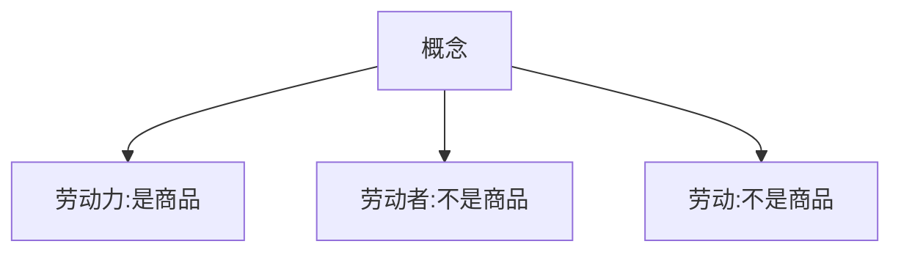
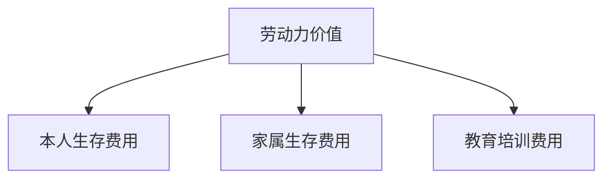
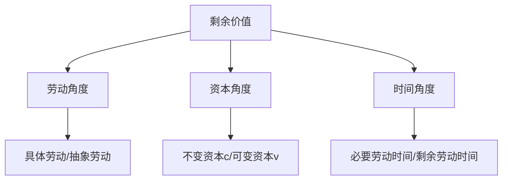

# 马克思主义政治经济学 - 发达商品经济（上）

## 考点64 资本主义经济制度的产生

### 资本主义生产关系产生的途径

- 从小商品经济中分化出来
- 从商人和高利贷者转化而来

### 资本原始积累的途径

- 用暴力手段剥夺农民的土地
- 用暴力手段掠夺货币财富

---

## 考点65 劳动力成为商品与货币转化为资本

### 概念区分

### 劳动力成为商品的两个基本条件

- 劳动者在法律上是**自由人**

- 劳动者"自由"得**一无所有**

### 劳动力商品的价值

### 劳动力商品的使用价值

- 劳动力商品的使用价值就是**劳动**
- **劳动力商品的使用价值是价值的源泉**

---

## 考点67 剩余价值的生产

### 资本主义生产过程的二重性

- 生产物质资料的**劳动过程**
- 生产**剩余价值**的过程

### 三个角度理解剩余价值

---

## 徐涛点拨

- **易错点**：  - 劳动力 = 人的脑力和体力的总和（**是商品**）
  - 劳动者 = 指劳动的人（**不是商品**）
  - 劳动 = 劳动力的使用（**不是商品**）

- **易错点**：两个条件缺一不可，"自由"得一无所有是关键

- **易错点**：  - 不变资本（c）：购买生产资料的资本，价值**转移**到产品中
  - 可变资本（v）：购买劳动力的资本，能**增殖**，产生剩余价值
  - 剩余价值是在**剩余劳动时间**创造的

---

## 真题角度

- 从**劳动力成为商品**角度考查：两个基本条件、劳动力商品的价值和使用价值
- 从**剩余价值的生产**角度考查：不变资本和可变资本的区别、必要劳动时间和剩余劳动时间
- 从**资本主义生产过程**角度考查：二重性（劳动过程+剩余价值生产过程）

---

## 核心考点速记

- **劳动力成为商品**：资本主义商品生产的新阶段
- **劳动力商品使用价值**：是价值的源泉
- **资本分类**：不变资本（c）和可变资本（v）
- **剩余价值**：在剩余劳动时间创造的
- **资本主义生产过程**：劳动过程 + 剩余价值生产过程

