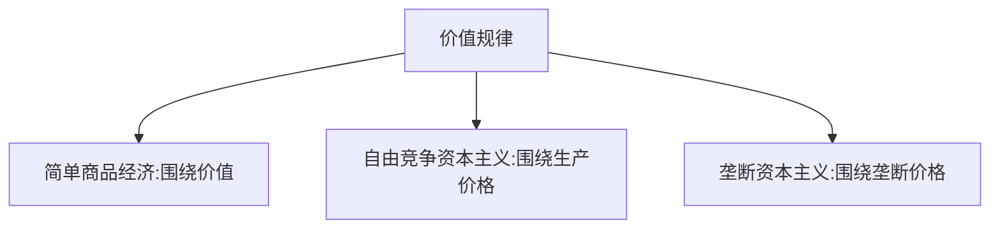

# 马克思主义政治经济学 - 垄断及当代资本主义

## 资本主义发展过程

```
自由竞争资本主义时期
        ↓
垄断资本主义时期
    ├── 个别垄断时期
    ├── 国家垄断时期
    └── 国际垄断时期
```

---

## 考点75 资本主义从自由竞争到垄断

### 垄断形成的途径

- **生产集中**：企业的生产规模越来越大，形成生产部门的垄断
- **资本集中**：资本的规模越来越大，形成金融资本的垄断

### 重要观点

> **垄断的出现并不会消除竞争**。只要私有制存在，竞争就不会被完全消除

### 金融资本形成的主要途径

| 途径 | 含义 |
|------|------|
| **金融联系** | 工业企业通过金融手段从银行获得信贷资金支持 |
| **资本参与** | 金融部门通过投资、入股参与到生产领域 |
| **人事参与** | 银行入股生产企业，派人进入董事会影响决策 |

### 控制方式

| 领域 | 方式 |
|------|------|
| **经济领域** | "参与制" |
| **政治领域** | "个人联合" |

### 垄断价格

> 垄断价格 = 成本价格 + 平均利润 + 垄断利润 = 生产价格 + 垄断利润

### 价值规律表现形式的变化



---

## 徐涛点拨


- **易错点**：  
  - 生产集中：企业的生产规模越来越大
  - 资本集中：资本的规模越来越大

- **易错点**：只要私有制存在，竞争就不会被完全消除

- **易错点**： 
  - 金融联系：工业企业通过金融手段从银行获得信贷资金支持
  - 资本参与：金融部门通过投资、入股参与到生产领域
  - 人事参与：银行入股生产企业，派人进入董事会影响决策


---

## 真题角度

- 从**垄断形成途径**角度考查：生产集中、资本集中
- 从**垄断与竞争**角度考查：垄断不消除竞争
- 从**金融资本形成**角度考查：三个途径
- 从**价值规律表现形式**角度考查：三个时期的变化

---

## 核心考点速记

- **垄断形成途径**：生产集中、资本集中
- **垄断不消除竞争**：只要私有制存在，竞争就存在
- **金融资本形成途径**：金融联系、资本参与、人事参与
- **垄断价格**：生产价格+垄断利润
- **价值规律表现形式**：价值→生产价格→垄断价格


