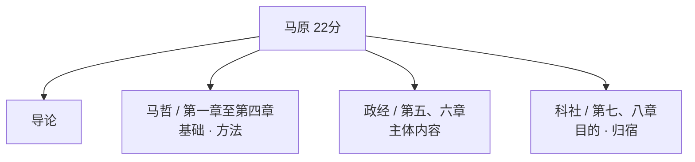

# 马克思主义基本原理 - 导论

## 学科概述

马原是考研政治六大学科之一，**分值 22 分**，超过总分五分之一。

三个特点：

- **分值高**（22分，重点学科）；

- **基础性强**（唯物论、认识论、唯物史观在毛中特、史纲、思修中反复出现）；

- **逻辑性强**（选择题几乎不考纯背诵，重在理解出题套路和逻辑）。

> 2026 年真题变化：政治经济学不再局限于选择题，已进入分析题。今年不能只抓马哲，要以平等态度对待所有知识点。

---

## 马原整体框架

整个马原由四大部分构成。先有一个**导论**（类似一本书的序言，交代什么是马克思主义、怎么来的、怎么发展的、有什么特点），然后是三大主体理论：

**马哲**（第一至四章）讲四个板块：唯物论、辩证法、认识论、唯物史观。

**政经**（第五、六章）以资本主义为研究对象，第五章讲自由资本主义，第六章讲垄断资本主义。

**科社**（第七、八章）第七章讲社会主义的发展，第八章讲共产主义的预测（共产主义本身还没来，学的是导师们对未来社会的描述）。

---

## 考点1 马克思主义的内涵及构成

**内涵**（非重点，浏览即可）：教材给了六个"是"——

1. 关于自然、社会和人类思维发展一般规律的学说；

2. 关于社会主义必然代替资本主义、最终实现共产主义的学说；

3. 关于无产阶级解放、全人类解放和每个人自由而全面发展的学说；

4. 无产阶级政党和社会主义国家的指导思想；

5. 指引人民创造美好生活的行动指南；

6. 由马恩创立并为后继者不断发展的科学理论体系。

### 三大组成部分及其关系

三个组成部分的地位不是并列的，它们构成一条推理链：

| 组成部分 | 地位 | 解释 |
|---------|------|------|
| **马克思主义哲学** | **基础**、**方法** | 哲学是世界观和方法论，是看待问题、研究问题的工具 |
| **马克思主义政治经济学** | **主体内容** | 马克思首先是经济学家，毕生最伟大的著作《资本论》就是政经的主体内容 |
| **科学社会主义** | **目的**、**归宿** | 学哲学、学经济学，最终是为了得出科学结论 |

**核心逻辑**：**马克思用哲学的方法研究了政经的内容，最终得出科社的结论——资本主义必将灭亡，社会主义、共产主义必将胜利。**

考试不直接问"马原有几个部分"，而是考三者各自处于什么地位、扮演什么角色。

### 理论来源

三个组成部分各有一个直接理论来源，一一对应：

| 组成部分 | 理论来源          |
| ---- | ------------- |
| 马哲   | **德国古典哲学**    |
| 马政经  | **英国古典政治经济学** |
| 科社   | **英法空想社会主义**  |

---

## 考点2 马克思主义的基本立场、观点和方法

**立场**：站谁一边、为谁说话的问题。立场不同于是非——是非是对错，立场是"我维护谁的利益"。马克思站在**无产阶级**一边、**人民群众**一边。考试问"马克思的立场是什么"，选项里找和"人"有关的表述：人民、无产阶级、人民群众。

**基本观点**：关于**自然、社会和人类思维发展一般规律**的科学认识。关键词是"全面"——既有大自然的看法，有人类社会的理论，还有人类思维的思考。命题人喜欢以偏概全，出"马克思主义仅仅是关于人类社会发展规律的学说"——错，不仅仅局限于人类社会。

**基本方法**：笼统说是两个——**辩证唯物主义**和**历史唯物主义**（单选题选这两个）。拆开来看还包含：实事求是法、辩证分析法、社会基本矛盾和主要矛盾分析法、历史分析法、阶级分析法、群众路线法（多选题这些都可以选）。

---

## 考点3 马克思主义的创立

### 创立历程

早期欧洲工人组织**正义者同盟**（是"组织"不是"政党"，组织无纲领，政党须有党纲）从事反资产阶级斗争，但缺乏科学理论指导，于是频繁向马恩写信求助。马恩的一篇回信就是后来著名的 **《共产党宣言》**。正义者同盟由此改名为**共产主义者同盟**，《共产党宣言》成为其党纲。

考点链：
	**共产主义者同盟 = 世界上第一个无产阶级政党**（正义者同盟是前身）；
	**共产党宣言  = 第一个无产阶级政党的党纲 = 马克思主义公开问世的标志**。

### 创立的背景

**社会根源**（时代背景）：**资本主义的生产方式在西欧有了相当的发展**。

**阶级基础**（实践基础）：**无产阶级反抗资产阶级剥削压迫的斗争**。

19 世纪三四十年代，欧洲爆发了三次早期工人运动——1831 年和 1834 年法国里昂工人起义、1836 年英国宪章运动、1844 年德国西里西亚纺织工人起义。

这三大工人运动标志着**现代无产阶级作为独立的政治力量登上了历史舞台**。

> **易混淆对比**：
> 
> 	世界无产阶级登上历史舞台 → 以欧洲三大工人运动为标志。
> 	**中国无产阶级**登上历史舞台 → 以**五四运动**为标志。
> 
> 这两个知识点分属马原和史纲，考试喜欢混在一起考，必须放在一起记。

### 思想渊源

即考点1所列的三个理论来源，分别对应马哲、政经、科社。马克思是在批判继承前人基础上创立的，并非凭空冥想。

---

## 考点4 马克思主义的发展

考点四整体**非重点**，只需掌握列宁的 **"一国胜利论"**：

**因为资本主义经济政治发展不平衡，所以社会主义革命可能在一国或数国首先取得胜利。**

关键在**因果关系**。马恩认为资本主义高度发达后会普遍灭亡，人类共同进入社会主义。但列宁观察到资本主义国家发展参差不齐——有的刚萌芽，有的已到垄断帝国主义——这就是"不平衡"。因为不平衡，所以不会同时灭亡，有的先亡先进社会主义。

考试问："列宁认为某些国家会先灭亡、先进入社会主义，他之所以这么说是基于什么理论？"

答案就是 **资本主义经济政治发展不平衡**。考的不是"一国胜利论"这个名字，是因果。

---

## 考点5 马克思主义的基本特征（重点）

马克思主义有四大特征：**科学性、人民性、实践性、发展性**。考试绝不会让你默写这四个名词——它会在题干中描述某个特征的含义，让你匹配是哪个特征。所以关键不是背名字，是理解每个特征的含义。

### 四个特征详解

**科学性**：就是对的意思，马克思主义是对自然、社会、人类思维发展本质规律的正确反映。科学性是马克思主义独有的特征——只有马克思主义是完全正确的，其他理论都不正确或不完全正确。

**人民性**：马克思主义的本质属性，也是其政治立场。站在人民一边，为人民谋福利。

**实践性**：实践的观点是马克思主义首要的、基本的观点，也是马克思主义独有的特征（另一个独有特征是科学性）。马克思墓碑上刻着："以往的哲学家都致力于解释世界，而问题在于改造世界。"

**发展性**：马克思主义不是一成不变的，是不断发展、开放的学说，具有与时俱进的品质。这解释了"真理具有相对性"与"马克思主义永远正确"为什么不矛盾——马克思主义本身是动态变动的，过时的内容会被修正淘汰，只有与时俱进才能保持正确性。

---

拆开是四个特征，概括起来是两个：**科学性与革命性的统一**。

 革命性 = 人民性 + 实践性 + 发展性 

革命性不是一个独立于四者之外的第五个特征，而是后三者的合称。

它的含义也很直观：革命是人民的革命，革命本身就是实践，革命推动事物向前发展。

所以教材说"革命性是人民性、实践性和发展性的应有之义和必然要求"。

---

> **导论总结**：导论以选择题为主，多为"什么是什么"的记忆型内容。后面章节逻辑性会越来越强。

---
## 经典著作总结（高频选择题考点）

这部分是散落在教材各处的马恩列经典著作的大汇总，近五年考了好几次，往往作为试卷**单选第一题**出现。前四篇最重要。

### 前四篇核心著作

| 著作 | 核心内容 | 标志意义 |
|------|---------|---------|
| **《德意志意识形态》** | 首次系统阐述了**唯物史观** | 标志着**马哲**的诞生 |
| **《资本论》** | 系统阐述了**剩余价值理论** | 标志着**政经**的诞生 |
| **《共产党宣言》** | — | 标志着**科社**的诞生，同时也标志着**整个马克思主义**的诞生 / 公开问世 |
| **《反杜林论》** | 恩格斯将马克思的全部理论**区分为马哲、政经、科社三个部分**并全面阐述 | — |

《共产党宣言》同时标志科社诞生和整个马克思主义诞生，因为科社是三大理论中最后一个——三个都诞生了，整体就完整了。

> 马克思本人写作时并未刻意区分"这篇是马哲、那篇是政经"，是后来恩格斯在《反杜林论》中首次做了区分。

### 其他重要著作速查

| 著作               | 考点一句话                                                |
| ---------------- | ---------------------------------------------------- |
| 《德法年鉴》           | 马恩在该期刊发表文章，标志着他们实现了**两个转变**（从唯心主义→唯物主义，从革命民主主义→共产主义） |
| 《神圣家族》           | 马恩**第一次合著**，批判青年黑格尔派的主观唯心主义                          |
| 《1844年经济学哲学手稿》   | 阐述了**异化劳动**理论                                        |
| 《关于费尔巴哈的提纲》      | 首次确立了**科学的实践观**                                      |
| 《哲学的贫困》          | 马克思主义的**第一次公开阐述**（注意与"公开问世"区分）                       |
| 《法兰西内战》          | 科学总结了**巴黎公社**的经验和教训                                  |
| 《家庭、私有制和国家的起源》   | **马恩的国家学说**（注意区分：后面还有列宁的国家学说）                        |
| 《帝国主义是资本主义的最高阶段》 | 指出帝国主义是**无产阶级革命的前夜**                                 |
| 《论欧洲联邦口号》        | **首次**提出一国胜利论                                        |
| 《无产阶级革命的军事纲领》    | 进一步发挥一国胜利论                                           |
| 《国家与革命》          | **列宁的国家学说**（区分马恩的国家学说）                               |
| 《唯物主义和经验批判主义》    | 批判马赫主义，全面阐述马克思主义哲学                                   |
| 《哲学笔记》           | 列宁丰富和发展了**唯物辩证法**                                    |

> 一国胜利论如果是多选题，两篇都可以选；如果是单选题，一般选《论欧洲联邦口号》（首次提出）。
