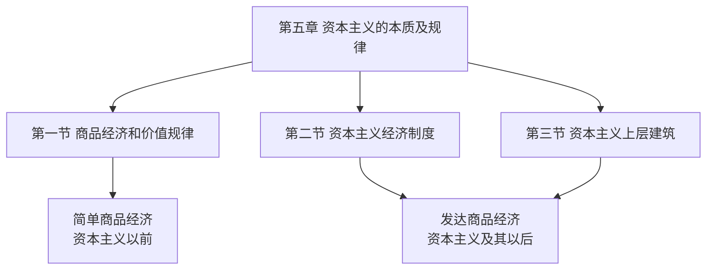
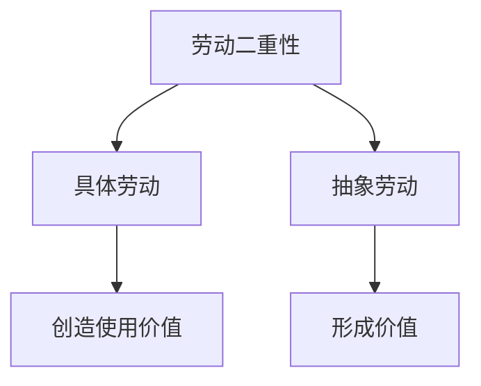

# 马克思主义政治经济学 - 简单商品经济（上）

## 第五章框架

第五章"资本主义的本质及规律"包含三个部分，按经济发展阶段分为两大类：

简单商品经济早在奴隶社会、封建社会甚至原始社会就已存在——只要有交换就有商品经济。资本主义及其以后的商品经济称为发达商品经济。

> 由于马克思生活的年代是资本主义年代，他所研究的"发达"主要局限于资本主义经济。

> 2026 考研真题变化：政治经济学不再局限于选择题，已进入分析题。今年不能只抓马哲，要以平等态度对待政经。

第一节全部内容围绕"**价值**"这一概念展开，分别探讨四个问题：

对应考点 58、59、60、61。本节课讲解考点 58 和 59。

---

## 考点58 价值是什么

### 商品经济及其产生条件

商品经济是以交换为目的而进行生产的一种经济形式。其产生必须**同时满足**两个社会历史条件：

1. **社会分工的存在**——不同个体或群体之间劳动的分工，如"耕田"与"织布"。

2. **生产资料和劳动产品属于不同的所有者**——分工之后，我生产的是我的，你生产的是你的，想要对方的就得交换。

两个条件缺一不可。家庭内部虽有分工（爸爸种粮、妈妈缝衣），但因财产共有，不需要交换。只有分工且分属不同所有者，商品交换才会产生。

### 商品二因素

商品是用来交换的、能满足人们某种需要的劳动产品，具有**使用价值**和**价值**两个因素，是使用价值和价值的矛盾统一体。

> **交换价值不属于商品二因素。** 商品二因素只有使用价值和价值，不要把交换价值混进来。

**使用价值**：商品能满足人的某种需要的属性，即商品的有用性。它反映人与自然之间的物质关系，是商品的**自然属性**。

使用价值是一切劳动产品所共有的属性——一个东西是商品肯定有使用价值，但不是商品也可能有使用价值（自己做包子自己吃，不是商品，但仍有使用价值）。

**价值**：凝结在商品中的无差别的一般人类劳动，即人的体力和脑力的耗费。价值是商品所特有的**社会属性**，只有通过人与人之间的交换才能体现。

### 价值的本质

**价值即劳动。**

一支笔的价值是什么？就是为了把它生产出来而曾经耗费过的劳动。抓住这一点，很多问题就能迎刃而解：

> 没有经过劳动而天然存在的东西，就一定没有价值。

空气有使用价值（人离不开它），但没有价值——因为它不是劳动创造的，是天然存在的。

物品具有价值必须**同时具备**两个条件：

1. 必须是**劳动所得**——天然存在的东西没有价值。

2. 必须经过**交换**——自己做包子自己吃，虽是劳动所得，但没经过交换，不是商品，就没有价值。价值是商品特有的属性。

### 社会财富 = 使用价值

在考研政治中，"**社会财富**"一词等同于"**使用价值**"，不是价值。

一个社会拥有很多"财富"，指的是有很多"有用的东西"。即便有一天社会不存在商品了（如共产主义社会，生产资料全民公有，不需要交换），"价值"概念消失，但"财富"概念依然存在——因为社会中可用的东西依然具有有用性。

### 交换价值

交换价值首先表现为一种使用价值同另一种使用价值交换的量的关系和比例。但**决定这种交换比例的不是使用价值，而是价值**。

举例：一个鼠标换两支笔。表面上看是用途的等价，实则是因为生产鼠标耗费 2 小时劳动、生产一支笔耗费 1 小时劳动，2 小时劳动 = 2 小时劳动，所以一个鼠标换两支笔。

为什么不能靠使用价值决定交换比例？因为使用价值因人而异——天天用电脑的人觉得鼠标好有用，从不碰电脑的人觉得鼠标没用；刚喝饱水的人不想花钱买水，渴得要死的人愿意花高价买水。用途是主观的，确定不了固定比例。价值是无差别人类劳动的凝结，劳动时间是客观的，可以测量和比较。

**价值是交换价值的基础，交换价值是价值的表现形式。**

### 使用价值与价值的对立统一

二者是对立统一的关系，用八个字理解：**缺一不可，不可兼得**。

**缺一不可**：每个商品同时具备使用价值和价值，少掉一个就不叫商品。无使用价值则无价值，非劳动产品也无价值。

**不可兼得**：对市场上的任何一个人来说，不可能同时占有同一件商品的使用价值和价值，只能得到其中一个。

- 卖方获得价值，让出使用价值。
- 买方获得使用价值，付出价值。

### 劳动二重性

为什么商品具有两因素？因为生产商品的劳动具有二重性。劳动二重性决定商品二因素，这是因果关系，也是考试出题的点：

**具体劳动**：生产一定使用价值的具体形式的劳动。从劳动的具体形式来看，世上所有劳动都是具体劳动，各有不同形式——讲课的劳动、扫街的劳动，形式各异。正因为具体形式不同，产出的东西才有各种不同的使用价值。

**抽象劳动**：撇开劳动的具体形式、无差别的一般人类劳动，即人的体力和脑力的耗费。抛开形式来看，世上所有劳动无非都是人在耗费体力和脑力。正因为劳动在抽象意义上是相同的，产出的东西才具有同性质的价值——虽然量有大小，但性质一样，可以交换。

> 做题技巧："具体劳动"与"使用价值"同选同不选，"抽象劳动"与"价值"同选同不选。 因为抽象劳动就是价值的实体，这两个词在政经做题中是等价的。

具体劳动和抽象劳动不是两个劳动，也不是两次劳动，而是**同一劳动的两个方面**，不可分割。关键看角度：从具体形式看是具体劳动，从撇开形式看是抽象劳动。

---

## 考点59 价值如何衡量

### 社会必要劳动时间

价值就是劳动，所以价值量靠劳动来衡量。靠劳动的什么来衡量？不能靠辛苦程度——你说你累，我说我也累，没法客观衡量。唯一客观、可测量的尺度是**时间**。

但不是看个人干了多久（个别劳动时间），而是看全社会平均需要多久。

**社会必要劳动时间**：在现有社会正常的生产条件下，在社会平均的劳动熟练程度和劳动强度下，制造某种使用价值所需要的时间。

> **决定商品价值量的不是个别劳动时间，而是社会必要劳动时间。**

### 价值量与劳动生产率的关系

**劳动生产率**即劳动的效率。社会劳动生产率越高，生产一件商品所需的平均时间越短，单位商品的价值量就越小。所以商品价值量与劳动生产率成**反比**。

科技产品刚推出时很贵，两年后大幅降价——因为技术迭代了，生产效率提高了，价值量降低了。

### 核心表格：劳动生产率变化的影响

社会率或个别率提高一倍时，核心差异如下：

| 条件 | 单品价值量 | 价值总量 |
|------|---------|---------|
| 社会率 | **降低** | **不变** |
| 个别率 | 不变 | 提高 |

三列常量：商品数量始终提高；单品使用价值量始终不变；使用价值总量（财富总量）始终提高。

- **社会率→价值总量不变**：单品价值量降一倍 × 商品数量多一倍 = 抵消。

- **个别率→价值总量提高**：单品价值量不变（由社会必要劳动时间决定），但商品数量多了，总价值随之增加。

- **使用价值量永远不变**：一个东西有多大用处跟做得快慢无关，只跟东西本身有关。

### 个别劳动生产率与市场竞争

当全社会都没改变技术，一个人率先引进新技术、提高劳动生产率，此人在市场上处于有利地位。

社会平均需 2 小时生产一支笔，此人 1 小时就能生产。他拿着 1 小时做出来的笔，可以按 2 小时的价值量卖——甚至按 1.5 小时卖，既比对手便宜又有钱赚，对手则面临破产。

因此在商品经济时期，每个人都有争先恐后改进技术的原始驱动力，不需要谁逼迫。

### 影响劳动生产率的四个因素

四个因素都与劳动生产率成**正比**：

1. **劳动者的平均熟练程度**——越熟练，效率越高。

2. **科学技术的发展水平及其在生产中的应用程度**——科技越发达，效率越高。

3. **生产过程的社会结合**——即分工，分工越明细，效率越高。

4. **生产资料的规模、效能及自然条件**——规模越大、自然条件越有利，效率越高。

### 简单劳动与复杂劳动

有的劳动很简单，不需要培训或简单培训一两天就能上岗（如养鸡）；有的劳动很复杂，需要长时间学习训练才能掌握（如开飞机）。

两者之间必须能交换，否则社会就乱套了——养鸡的这辈子别想坐飞机，开飞机的这辈子别想吃鸡。

交换时不能简单等价（1 小时养鸡 ≠ 1 小时开飞机），需要一套换算比例：

- 商品的价值量以**简单劳动**为尺度来计量。

- 复杂劳动等于**自乘**的或**多倍**的简单劳动。

**"自乘"** 意味着这个比例不能人为规定，而由 **市场自发调节**。市场像一把无形的手，会自动把比例调整到合理位置——某行业吃了亏就没人干，从业者减少后该行业价值回升；某行业占了便宜就蜂拥而入，从业者增多后该行业价值下降。不需要政府规定，也不能协商决定，否则会导致市场扭曲。

---

## 真题演练

### 第27题（单选）

《资本论》中有这样的表述："对于上衣来说，无论是裁缝自己穿还是其他顾客穿，都是一样的。"这是因为无论谁穿——

A. 上衣都起着使用价值的作用

B. 上衣都起着价值的作用

C. 上衣都是抽象劳动的结果

D. 上衣都是社会劳动的结果

---

> [!example] 解析
> **A 正确**：无论谁穿，上衣都能满足穿着需要，都起着使用价值的作用。
>
> **B 错误**：裁缝自己穿时上衣不是商品（没有交换），此时没有价值。
>
> **C 错误**："抽象劳动"与"价值"等价，B 不选则 C 也不选。
>
> **D 错误**：社会劳动指为别人的劳动，裁缝自己穿是为自己劳动，不是社会劳动。
>
> **答案：A**

> [!danger] 易错
> B 和 C 是等价选项，要选一起选、不选都不选。做题时看到"抽象劳动"就想到"价值"，两者在政经中是同义词。

### 第28题（单选）

马克思在《资本论》中指出："不管生产力发生了什么变化，同一劳动在同样的时间内提供的价值量总是相同的。但它在同样的时间内提供的使用价值量是不同的：生产力提高时就多些，生产力降低时就少些。"这段话表明，生产力的变化——

A. 不影响同一劳动在同样的时间内生产的商品数量

B. 不改变同一劳动在同样的时间内的生产效率

C. 影响同一劳动在同样的时间内生产的单个商品价值量

D. 改变同一劳动在同样的时间内提供的价值总量

---

> [!example] 解析
> 生产力即社会劳动生产率。
>
> **A 错误**：社会率提高时，单位时间内商品数量增多。
>
> **B 错误**：效率必然提高。
>
> **C 正确**：单个商品价值量降低。
>
> **D 错误**：价值总量不变。价值总量 = 单个商品价值量 × 商品数量，降低一倍乘以增多一倍，最终不变。
>
> **答案：C**

> [!danger] 易错
> 这道题考的就是核心表格。记住"社会率变，价值总量不变"是关键——单个商品价值量降了，但商品数量多了，乘积不变。
